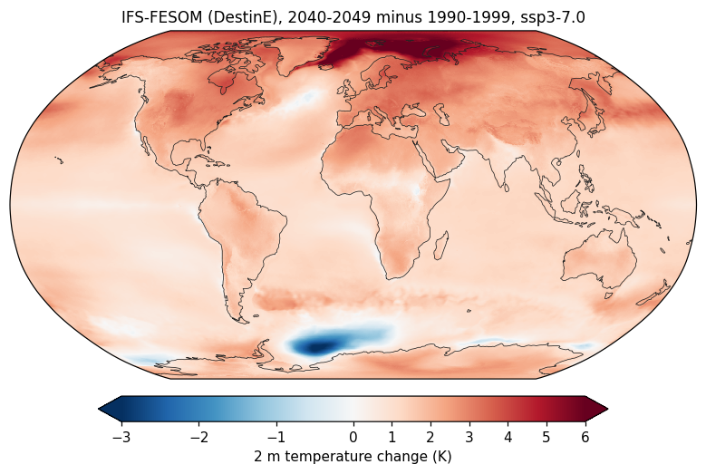

# cdors on Levante

**cdors runs CDO's analysis operators, many times faster.** Same commands as cdo, on Zarr, kerchunk and NetCDF.
cdors reads only the chunks it needs, in parallel, reads the EERIE cloud (cdo cannot), and shows what a run will
read before it runs. It is a prototype (0.1.0, October 2026): 187 operators, each compared with cdo 2.6.0.

The same command with cdo and with cdors, wall time on one Levante compute node:

| Command | Data | cdo | cdors | Faster |
|---|---|---|---|---|
| `ydaymean`, 30 years of 3-hourly global data | 1.1 TB | 1 h 35 min | 79 s | **72×** |
| `timpctl,95`, one year of 3-hourly global data | 38 GB | 6 min 56 s | 8.6 s | **49×** |
| `fldmean` of a region, 240 NetCDF files | 15 GB | 38.5 s | 3.6 s | **11×** |
| `remap` to 1°, 120 NetCDF files | 7.6 GB | 23.7 s | 2.8 s | **8.6×** |
| `yearmean`, a decade of daily global data | 46 GB | 42.8 s | 7.8 s | **5.5×** |

Global data: nextGEMS ICON, 3.1 million HEALPix cells. The results agree with cdo's. On tiny files cdo is faster
(cdors needs 0.2–0.3 s to start). Details: `doc/bench-results.md`.

On the 6 km DestinE projections: 60 years of global-mean temperature from 36 GB in 6–20 s (cdo: about a minute), and
a 6 km warming map in 15 s (see "Larger problems").

## Try it

Start on a login node. One line makes `cdors` available; then try it: the July mean of 2 m temperature over Europe
(10°W–40°E, 35–70°N) for five years, from 30 years of daily global data:

```bash
export PATH=/work/ab0995/a270088/cdors/bin:$PATH     # add to ~/.bashrc to keep it

D=/work/kd1453/rechunked_ngc4008/ngc4008_P1D_9.zarr
cdors outputtab,date,value -yearmean -fldmean -sellonlatbox,-10,40,35,70 -selmon,7 -selyear,2020/2024 -selname,tas $D
```
```
#      date    value
 2020-07-16 291.8761
 2021-07-16 292.4609
 2022-07-16 292.7205
 2023-07-16 292.4945
 2024-07-16 292.9499
```

That took 0.6 s on a login node. Data: nextGEMS ICON `ngc4008`, daily, 3,145,728 HEALPix cells, 2020–2049. cdors
read 60 of the 17,568 chunks of `tas` (0.47 GB).

The examples go from small to large. Examples 1–6 ran on a login node, the larger problems after them on an
interactive node with 128 CPUs (2026-10-09).

## Example 1: look at a dataset

```bash
D=/work/kd1453/rechunked_ngc4008/ngc4008_P1D_9.zarr
cdors showname $D
cdors sinfo $D
```
```
   File format : Zarr v2
    -1 : T Levels    Points Dtype   Chunks               : Parameter name
     1 : v     73   3145728 float32 7x11x65536           : A_tracer_v_to
     2 : v      1   3145728 float32 30x65536             : FrshFlux_IceSalt
   ...
   Grid coordinates :
     1 : healpix                  : points=3145728 nside=512 order=Nested
   Vertical coordinates :
     1 : depth_half               : levels=73 units=m
   ...
   Time coordinate :
                             time : 10958 steps
     Units = seconds since 1970-01-01  Calendar = proleptic_gregorian
     First = 2020-01-02T00:00:00  Last = 2050-01-01T00:00:00
```

As JSON, for one variable:

```bash
cdors --json sinfo $D | jq '.variables[] | select(.name=="tas") | {units, shape, chunks, codecs}'
```
```json
{
  "units": "K",
  "shape": [10958, 3145728],
  "chunks": [30, 65536],
  "codecs": "blosc:lz4"
}
```

## Example 2: one point, a 95th percentile

95th percentile of 3-hourly 2 m temperature at Hamburg in 2020, from the 1.1 TB 3-hourly store:

```bash
H3=/work/kd1453/rechunked_ngc4008/ngc4008_PT3H_9.zarr
cdors outputtab,date,lon,lat,value -timpctl,95 -remapnn,lon=10_lat=53.55 -selyear,2020 -selname,tas $H3
```
```
#      date    lon    lat    value
 2020-07-02     10  53.55   292.12
```

2.3 s the first time, mostly cdo making the weights, which are then cached. cdors reads only the 12 of 67,968 chunks
that hold this cell in 2020 (195 MB). Percentiles are exact for any number of values; cdo approximates above 50 per
cell.

## Example 3: remap to a regular grid

HadGEM3 (CMIP6) sea surface temperature from the curvilinear ORCA1 grid to 1°, 2000–2014 mean:

```bash
F=/work/ik1017/CMIP6/data/CMIP6/CMIP/MOHC/HadGEM3-GC31-LL/historical/r1i1p1f3/Omon/tos/gn/v20190624/tos_Omon_HadGEM3-GC31-LL_historical_r1i1p1f3_gn_195001-201412.nc
cdors -remapbil,r360x180 -timmean -selyear,2000/2014 $F tos_clim_1deg.nc
```

3.9 s the first time, while cdo makes the weights (cached in `$CDORS_CACHE`), 0.5 s after. `remapnn`, `remapdis`,
`remapbil`, `remapcon` and `remapycon` take cdo's grid names (`r360x180`, `global_1`, `hpz7`, `lon=10_lat=53.55`,
...), grid description files or another dataset's grid; `remap,<grid>,<weights.nc>` uses your own weights.

## Example 4: EERIE data — kerchunk references, raw NetCDF files, the cloud

ICON-ESM-ER (`eerie-control-1950`), daily, 0.25°, read three ways.

**Kerchunk references** from the DKRZ EERIE catalog (Parquet):

```bash
K=/work/bm1344/k202193/Kerchunk/erc2002/control_1950/v20240618/atm_2d_1d_mean_remap025.parq
cdors outputtab,date,value -mulc,86400 -monmean -fldmean -sellonlatbox,-60,0,20,60 -selyear,1950 -selname,pr $K
```
```
#      date    value
 1950-01-16 3.164306
 1950-02-15 3.216423
 ...
 1950-12-16 3.669047
```

North Atlantic precipitation in mm/day per month of 1950, in 1.8 s.

**Raw NetCDF files.** A quoted glob is one input; cdors sorts the files and joins them along time:

```bash
R=/work/bm1344/k202193/ICON/erc2002/postprocessing/interpolation/control_1950/atm_2d_1d_mean_remap025
cdors -fldmean -sellonlatbox,-60,0,20,60 -selname,pr "$R/run_199[1-5]*/*.nc" pr_natl.nc
```

120 files, five years, 7.6 GB. The first run takes 20–60 s while cdors indexes the files (kept in
`$CDORS_CACHE`); later runs about 3 s. These files carry the model's own years: 1991 here is 1950 in the catalog.

**The EERIE cloud**: the same dataset over HTTPS, from anywhere:

```bash
U=https://eerie.cloud.dkrz.de/datasets/icon-esm-er.eerie-control-1950.v20240618.atmos.gr025.2d_daily_mean/kerchunk
cdors sinfo $U
cdors outputtab,date,value -timmean -fldmean -sellonlatbox,-10,40,35,70 -selmon,1 -selyear,1950 -selname,tas $U
```
```
#      date    value
 1950-01-16 274.6871
```

1.8 s from the cloud, 0.8 s from the kerchunk references, same value. The server gives about 0.2 GB/s. Datasets:
`https://eerie.cloud.dkrz.de/datasets`. cdo cannot read these URLs.

**GRIB through gribscan references**: IFS-FESOM (`hist-1950`), monthly means on pressure levels, 0.25°, stored as
GRIB messages with references made by gribscan:

```bash
G=/work/bm1344/k202193/Kerchunk/IFS-FESOM_sr/3D_monthly_0.25deg_atmos_avg.parq
cdors outputtab,date,value -fldmean -sellevel,85000 -selyear,1950 -selname,mt $G
```
```
#      date    value
 1950-01-15 279.185209266673
 ...
 1950-12-15 279.269668279689
```

Global mean temperature at 850 hPa per month of 1950, in 0.6 s; all 684 months to 2006 take 1.3 s. cdors decodes the
GRIB messages itself and puts gribscan's flattened grid back on its 1440 × 721 lon-lat grid, so the mean is
area-weighted, as cdo's. cdo 2.6.0 cannot read these messages at all (cdo 2.5.0 can: 13 s for the 684 months, the
same values). The references stamp monthly means mid-month; cdo stamps them at the end of the month. The native
O1280 grid (`gribscan_1m_NATIVE`) works too: cdors weights its reduced Gaussian rows by cell area, and the January
1950 global mean skin temperature agrees with the 0.25° one to 0.0001 K. From 2007 on, the files these references
point to are gone; cdors names the missing file and the time step.

## Example 5: scripts and agents

Every command takes `--json`: values as one JSON object, errors as one JSON object on stderr with a code and a hint:

```bash
cdors --json outputtab,date,value -fldmean -seltimestep,1/3 -selname,tas $D | jq -c '.records'
```
```json
[{"date":"2020-01-02","value":286.30957},{"date":"2020-01-03","value":286.11243},{"date":"2020-01-04","value":285.9965}]
```
```bash
cdors --json -yearmaen in.nc out.nc
```
```json
{"error":"unknown_operator","message":"unknown operator 'yearmaen'","operator":"yearmaen","suggestions":["yearmax","yearmean","yearmin"],"exit_code":1,"retryable":false,"hint":"did you mean yearmax or yearmean or yearmin?"}
```

From Python 3.7 or newer:

```python
import json, subprocess

D = "/work/kd1453/rechunked_ngc4008/ngc4008_P1D_9.zarr"
cmd = ["cdors", "--json", "outputtab,date,value", "-fldmean", "-sellonlatbox,-10,40,35,70",
       "-selmon,7", "-selyear,2020", "-selname,tas", D]
r = subprocess.run(cmd, capture_output=True, text=True)
if r.returncode != 0:
    raise RuntimeError(json.loads(r.stderr.splitlines()[-1])["message"])
records = json.loads(r.stdout)["records"]    # 31 records: {'date': '2020-07-01', 'value': 291.0806}, ...
```

Exit codes:

| Code | Meaning |
|---|---|
| 0 | success |
| 1 | the command is wrong (unknown operator, bad arguments, missing input, ...) |
| 2 | the data are the problem (bad data, unsupported grid, memory limit, ...) |
| 3 | an I/O error worth retrying (timeouts, HTTP 5xx) |
| 4 | refused (read limit, too many values, existing output) |

AI agents can start with `cdors guide` (5 kB, written for them). With it, agents answered five of five test analyses
correctly, 4× faster than with cdo and Python, at 1.3× the cost. Full reference: `doc/reference.md`.

## Example 6: plan first, then run

A monthly climatology over ten years:

```bash
cdors --plan -ymonmean -selyear,2020/2029 -selname,tas $D tas_ymonmean.nc
```
```
inputs: /work/kd1453/rechunked_ngc4008/ngc4008_P1D_9.zarr
output: tas_ymonmean.nc (nc4)
stage 1 of 1: selname,tas -> selyear,2020/2029 -> ymonmean, folded by ymonmean along time, 1 pass(es)
  read: 5856 chunks, 46.1 GB decoded, ~25.7 GB stored (estimate from 8 chunks); 5856 tiles
memory: ~2.9 GB peak of 4.3 GB budget (...)
settings: 16 compute threads, 64 reads in flight (login node)
read limit: 64.0 GB (login-node default, no SLURM_JOB_ID)
```

46 GB is under the login node's limit of 64 GB; it takes 5.8 s:

```bash
time cdors -ymonmean -selyear,2020/2029 -selname,tas $D tas_ymonmean.nc     # 5.8 s
cdors infon tas_ymonmean.nc
```
```
    -1 :       Date     Time   Level Gridsize    Miss :     Minimum        Mean     Maximum : Parameter name
     1 : 2029-01-31 00:00:00       0  3145728       0 :      226.34      284.85      304.57 : tas
     2 : 2029-02-28 00:00:00       0  3145728       0 :      226.70      285.21      306.14 : tas
   ...
```

Ordinary CF NetCDF, readable by cdo and xarray. For ushow, add `--lonlat` to write the HEALPix cell centres too (25
MB here):

```bash
cdors --lonlat -ymonmean -selyear,2020/2029 -selname,tas $D tas_ymonmean.nc
ushow tas_ymonmean.nc
```

`info`, `infon`, `output`, `outputf` and `outputtab` print any chain's result in cdo's format, up to a million
values (`--max-values`).

## Larger problems: an interactive node

When problems get large, with millions of cells per field over decades, move to an interactive node: there cdors
uses every core it gets and has no read limit. `salloc` opens a shell on the node; `exit` ends it, and the session
is billed while open:

```bash
salloc -p interactive -A <your project> -c 128 --mem=200G -t 01:00:00     # half a node: 64 cores
```

The DestinE examples below ran in such a session.

DestinE Generation 2 climate projections: monthly means on 12,582,912 HEALPix cells (about 6 km) from IFS-FESOM,
IFS-NEMO and ICON, 1990–2014 (historical) and 2015–2049 (SSP3-7.0). One Zarr store per variable and run; `228004` is
2 m temperature, 21 GB per run:

```bash
G=/work/ab0995/a270088/DestinE/GENERATION2_joint
ls $G/2D | head        # surface variables (high resolution); $G/3D: pressure levels and the ocean
H=$G/2D/baseline_hist_2_ifs-fesom_1_0001_clmn_high_sfc_228004.zarr
P=$G/2D/projections_ssp3-7.0_2_ifs-fesom_1_0001_clmn_high_sfc_228004.zarr
```

### Global warming in three models

One command per model, 36 GB each:

```bash
for m in ifs-fesom_1 ifs-nemo_1 icon_1; do
  cdors outputtab,date,value -yearmean -fldmean -mergetime \
    $G/2D/baseline_hist_2_${m}_0001_clmn_high_sfc_228004.zarr \
    $G/2D/projections_ssp3-7.0_2_${m}_0001_clmn_high_sfc_228004.zarr
done
```

60 annual global means each (`1990-06-16 287.522` ... `2049-06-16 289.0152` for IFS-FESOM), in 12 s, 16 s and 5.5 s.
The same with cdo, which needs brackets around the `-mergetime` inputs:

```bash
cdo -P 16 -outputtab,date,value -yearmean -fldmean -mergetime [ "file://$H#mode=zarr,file" "file://$P#mode=zarr,file" ]
```

On the same node, cdo took 66 s and cdors 20 s (in that session; the interactive nodes are shared, so times vary).
The results agree to 0.0001 K. Decadal means, in K:

| Decade | IFS-FESOM | IFS-NEMO | ICON |
|---|---|---|---|
| 1990s | 287.35 | 287.15 | 286.47 |
| 2000s | 287.55 | 287.26 | 286.75 |
| 2010s | 287.72 | 287.53 | 286.95 |
| 2020s | 288.11 | 287.72 | 287.14 |
| 2030s | 288.42 | 287.92 | 287.35 |
| 2040s | 288.88 | 288.31 | 287.52 |

The stores have no cell bounds, so all cells get equal weights, as in cdo; for HEALPix that is exact.

### A warming map at 6 km

2040s minus 1990s, all 12.6 million cells, in 15 s (12 GB):

```bash
cdors -sub -timmean -selyear,2040/2049 $P -timmean -selyear,1990/1999 $H dT.nc
cdors infon dT.nc
ushow dT.nc
```
```
    -1 :       Date     Time   Level Gridsize    Miss :     Minimum        Mean     Maximum : Parameter name
     1 : 2044-12-16 12:00:00       0 12582912       0 :     -3.1325      1.5266      8.8455 : avg_2t
```

`dT.nc` carries latitude and longitude, so ushow opens it directly.



*`dT.nc`, plotted with matplotlib on 0.25° boxes.*

### Hamburg, 60 years

Annual means at the nearest cell, 1990–2049:

```bash
cdors outputtab,date,value -yearmean -remapnn,lon=10_lat=53.55 -mergetime $H $P
```

21 s on the first run, while cdo makes the nearest-neighbour weights; 3.3 s after that. The 1990s average 281.16 K,
the 2040s 283.92 K.

### Ocean warming with depth

IFS-FESOM ocean temperature (`avg_thetao`, 69 levels, 196,608 cells), 2045–2049 minus 2015–2019, global mean per
level, in 1.4 s:

```bash
O=$G/3D/projections_ssp3-7.0_2_ifs-fesom_1_0001_clmn_standard_o3d_263501.zarr
cdors outputtab,lev,value -fldmean -sub -timmean -selyear,2045/2049 $O -timmean -selyear,2015/2019 $O
```

The depths of the levels are in `$G/levels.yaml` (`FESOM-NG5-full`):

| Depth | 2.5 m | 47.5 m | 97.5 m | 195 m | 480 m | 950 m | 2035 m | 4025 m | 6175 m |
|---|---|---|---|---|---|---|---|---|---|
| Change (K) | +0.85 | +0.63 | +0.37 | +0.15 | +0.12 | +0.13 | +0.005 | +0.02 | +0.06 |

## Very large problems: batch jobs

`--plan` shows when a command is too big for a login node, here the daily climatology over all 30 years of the
3-hourly store:

```bash
cdors --plan -ydaymean -seltimestep,1/87544 -selname,tas $H3
```
```
stage 1 of 1: selname,tas -> seltimestep,1/87544 -> ydaymean, folded by ydaymean along time, 1 pass(es), 192 lanes in 14 waves (lane-major)
  read: 67776 chunks, 1.1 TB decoded, ~626 GB stored (estimate from 8 chunks); 67776 tiles
memory: ~4.2 GB peak of 4.3 GB budget (...)
read limit: 64.0 GB (login-node default, no SLURM_JOB_ID) -- EXCEEDED: the run would be refused
```

Memory does not grow with the years read: cdors splits the cells into waves that fit the budget.

As a batch job, with your project as the account:

```bash
#!/bin/bash
#SBATCH --job-name=cdors-ydaymean
#SBATCH --partition=compute
#SBATCH --account=<your project>
#SBATCH --nodes=1
#SBATCH --exclusive
#SBATCH --mem=0
#SBATCH --time=00:30:00
#SBATCH --output=cdors-ydaymean-%j.log
set -e
export PATH=/work/ab0995/a270088/cdors/bin:$PATH
IN=/work/kd1453/rechunked_ngc4008/ngc4008_PT3H_9.zarr
cdors --mem 32G --progress json -ydaymean -seltimestep,1/87544 -selname,tas $IN tas_ydaymean_2020-2049.nc
```

Or interactively:

```bash
srun -p compute -A <your project> -N 1 --exclusive -t 00:30:00 cdors -ydaymean ... out.nc
```

In a Slurm job cdors uses all allocated cores, 128 reads in flight, no read limit and 60 % of the job's memory
(`--mem`). This is the 72× command from the top: 79 s, against 1 h 35 min for cdo. `--progress json` logs progress
once per second.

## The rules in one minute

- **Same syntax as cdo:** `cdors [options] -op3 -op2,args -op1 input output`.
- **Selections innermost** (`-selname`, `-selyear`, `-sellonlatbox`, ...): they decide which chunks are read.
- **Plan first:** `cdors --plan <command>` shows reads, memory, passes and where area weights come from, without
  reading data.
- **Equal-weights warning:** a framed `WARNING` about equal weights means the field mean is not area-weighted.
- **Outputs:** `.zarr` gives Zarr, anything else NetCDF-4; existing files need `-O`; `-z zip` compresses NetCDF
  (Zarr always is).
- **Login nodes:** 16 threads, 64 GB read per command, a 4 GiB memory plan.
- **Scripts:** add `--json`.
- **Missing operator:** run that step with cdo; `cdors ops` lists what exists.

## What the setup does

```bash
cdors --version
```
```
cdors 0.1.0
HDF5 1.14.3, netCDF-C 4.9.3-rc1
```

No module or conda environment is needed. `cdors` is a wrapper that sets two defaults; set either yourself to
override it:

- `CDORS_CACHE`: remap weights and NetCDF indexes, default `/scratch/<x>/<user>/cdors-cache`.
- `CDO`: the cdo that makes remap weights, default cdo 2.6.0.

Documentation next to the program, in `/work/ab0995/a270088/cdors/`:

| File | Contents |
|---|---|
| `README.md` | this guide |
| `doc/reference.md` | all options, JSON output, error codes, caches |
| `doc/deviations.md` | every known difference from cdo |
| `doc/bench-results.md`, `doc/criteria.md` | benchmarks against cdo and what the prototype has shown |
| `doc/LICENSE-CDO` | the license of CDO, from which cdors takes operator help texts and numerical routines |

## Differences from cdo you will notice

- Existing outputs need `-O`; `cat` never appends.
- The output format follows the file name, not the input. Integers and packed data become float64; cdo keeps
  integers and rounds their means.
- `-z zip` compresses on all cores and shuffles first: a 1.2 GB output became 648 MB in 1.1 s; `cdo -z zip` took
  28 s for 817 MB. `-z zstd` is for Zarr only; options cdors lacks (`-k`, `-r`, ...) are refused.
- Percentiles are exact; cdo uses a histogram above 50 values per cell. cdo's three-input form is accepted.
- `sinfo` prints its own summary, not cdo's table.
- `mergetime` and `cat` refuse overlapping or backward times.
- `sinfo`, `showname`, `griddes` and `showtimestamp` take files, not chains.
- A field mean over a grid without cell areas or bounds uses equal weights, as in cdo, but warns in a framed block
  (cdo: one line). cdors weights reduced Gaussian grids by cell area; cdo 2.6 weights them equally.
- GRIB through gribscan references: time stamps and level order are the references' (monthly means mid-month).

Full list: `doc/deviations.md`, with five cdo bugs found on the way (cdo 2.6.0, for one, misreads a partly filled
last time chunk of HEALPix Zarr).

## What it cannot do yet

- **GRIB without gribscan references, and GRIB1** (ERA5 in `/pool/data/ERA5`): use cdo. GRIB with gribscan
  references (EERIE IFS-FESOM) works, see Example 4.
- **Many cdo operators**, e.g. `expr`, `trend`, correlations, ETCCDI indices, `ydaypctl`, `intlevel`, ensemble
  statistics, EOFs.
- **Classic NetCDF output** (`-f nc4c` writes NetCDF-4).
- **Fast percentiles on data stored one field per chunk:** correct, but read several times.
- **Weights without cdo:** cdo makes them once per grid pair.
- **Tested S3:** implemented, not yet tried on a real bucket.

## Files cdors leaves behind

- `$CDORS_CACHE/weights/`: remapping weights and grid files from cdo.
- `$CDORS_CACHE/nc4index/`: chunk indexes of NetCDF-4 files.

Both can be deleted any time. A killed run can leave a hidden `.<output>.cdors-tmp-...` next to the output; remove
it by hand.

## Version and feedback

Installed: 0.1.0, commit `18bba8c` (2026-10-10), the build that passed the tests; older versions stay next to it.
Source: [github.com/koldunovn/cdors](https://github.com/koldunovn/cdors).

It is a prototype: send wrong numbers, confusing errors or slow commands, with the command and `cdors --version`, to
Nikolay Koldunov (a270088).

Contains help texts and routines derived from CDO (© 2002–2026 MPI für Meteorologie, BSD 3-Clause, `doc/LICENSE-CDO`
next to the program).